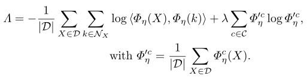

# SCAN: Learning to Classify Images without Labels
### 1 摘要

- two step learning, 特征学习和聚类是解耦的
- 表征学习的自监督任务用来获得语义有意义的特征。 用特征作为可学习的聚类方法的先验

### 2 引言

##### 表征学习

- 自监督， 仅从图像学习特征表征
- 使用**pre-designed**任务，称作**pretext task**， 不需要注释数据学习CNN权值
- 视觉特征由最小化目标函数得到
- 所谓两阶段学习的第一步。第二步一般监督的微调，验证自监督特性如何很好的转移到新任务中
- 次优的。**不平衡的集群**， 不保证学习到的集群与语义类一致

==聚类学习依赖于网络初始化，低级特征如颜色对语义聚类的目标是不必要的==

##### SCAN（Semantic Clustering by Adopting Nearest neighbors）

- 结合了表征法和端到端的优点，避免缺点
- 第一步
  - 通过pretext task学习表征 
  - 不用KNN聚类（因为有聚类退化），而是**基于特征相似度挖掘每幅图像的最近邻**
- 第二步
  - 将语义上有意义的**最近邻作为先验**集成到可学习的方法中
  - 通过一个损失函数，**最大化softmax(每幅图像和他的邻居的点积)**， 来分类图像和他的邻居, 迫使网络得到一致且有区别的预测
  - 不仅仅鼓励增强，也鼓励最近邻不变性，不许对输入做特定处理

### 3 方法

> 如何从pretext任务挖掘最近邻作为先验。额外的约束选择合适的pretext。
>
> 将获得的先验信息整合到一个新的损失函数中，对每一幅图像及其近邻进行分类。
>
> 如何用自标记方法来减轻最近邻选择中固有的噪声问题

##### 为语义聚类进行的表征学习

- 图像聚类对网络初始化敏感。在网络训练初期，网络并没有从图像提取高级信息，簇容易锁定低级特征。

- 采用表征学习以获得更好的语义聚类先验

- pretext  $$\tau$$自监督学习一个embedding函数$$Φ_θ$$, $$Φ_θ$$以一个带权重的神经网络参数化

- 为了增强$$\tau$$应对图像变换的不变性， 使其同时最小化图像X与其augumentationT[X]之间的距离

  

- 为什么有相似高级特征的图像会被映射得更近？

  - $$\tau$$输出以图像为条件，迫使Φθ从其输入中提取特定的信息
  - 由于Φθ的容量有限，它不得不放弃输入中对高级pretext task来说不可预测的信息

##### 语义聚类loss

- 挖掘最近的邻居（mine nearest neighbors）
  - 单纯对特征语义使用K均值会导致特征退化。*判别模型在学习决策边界时可能将所有的概率块分配给同一个簇， 导致一个簇支配其它簇*
  - 我们提出采用pretext 任务$$\tau$$得到的最近邻作为语义聚类的先验
- 损失函数
  - 目标：学习一个聚类函数$$Φ_η$$（以权值η参数化的神经网络）， 同时分类一个样本$$X_i$$和他的最近邻$$N_{x_i}$$
  - $$Φ_η$$以一个softmax函数，软分类
  - $$X_i$$被分到类c的概率记为：$$Φ^c_
    η(X_i)$$
  - 最小化损失函数：
    - 第一项对$$X_i$$和他的最近邻$$N_{x_i}$$做出一致性预测。当预测为one-hot(confident)且两者分到同一类(consistent)的时候有最大值。
    - 第二项为熵项，为避免将所有样本分配给单个簇
- 实现细节
  - 随机增强$$X_i$$和他的最近邻$$N_{x_i}$$。对于拐角K = 0的情况，只要求样本与其增量之间的一致性。
  - 设置K≥1以获取更多的簇方差，但代价是引入噪声
- 讨论
  - 没有在损失中包含重建标准
  - 一致性是通过损失中的点积项在单个样本的水平上强制执行的，而不是在类的联合分布的近似上

##### 通过自标注fine-tuning

- 在cluster后，每个样本与K≥1个邻居进行组合，其中一些不可避免地不属于同一个语义聚类。这些错误的正面例子导致了网络不确定的预测
- 原型：在聚类过程中形成的高置信度的预测可以被视为每个类的“原型”
- 提出了selflabel方法，利用已分类良好的示例纠正由于噪声最近邻造成的错误
  - 对输出处的概率进行阈值化，即$$p_{max}$$>阈值来选择置信样本
  - 对于每个可信样本，通过将样本分配给其预测的聚类，得到一个伪标签
  - 交叉熵损失用于更新得到的伪标签的权值
  - 避免过拟合，我们计算了自信样本的强增广（strong augument)版本的交叉熵损失

### 总体算法


### 实现

```bash
python moco.py --config_env configs/env.yml --config_exp configs/pretext/moco_aurora.yml
#or
python simclr.py --config_env configs/env.yml --config_exp configs/pretext/simclr_a.yml

python scan.py --config_env configs/env.yml --config_exp configs/scan/scan_aurora.yml
python selflabel.py --config_env configs/env.yml --config_exp configs/selflabel/selflabel_aurora.yml

# eval
python eval.py --config_exp configs/selflabel/selflabel_aurora.yml --model results/aurora/selflabel/model.pth.tar
```

