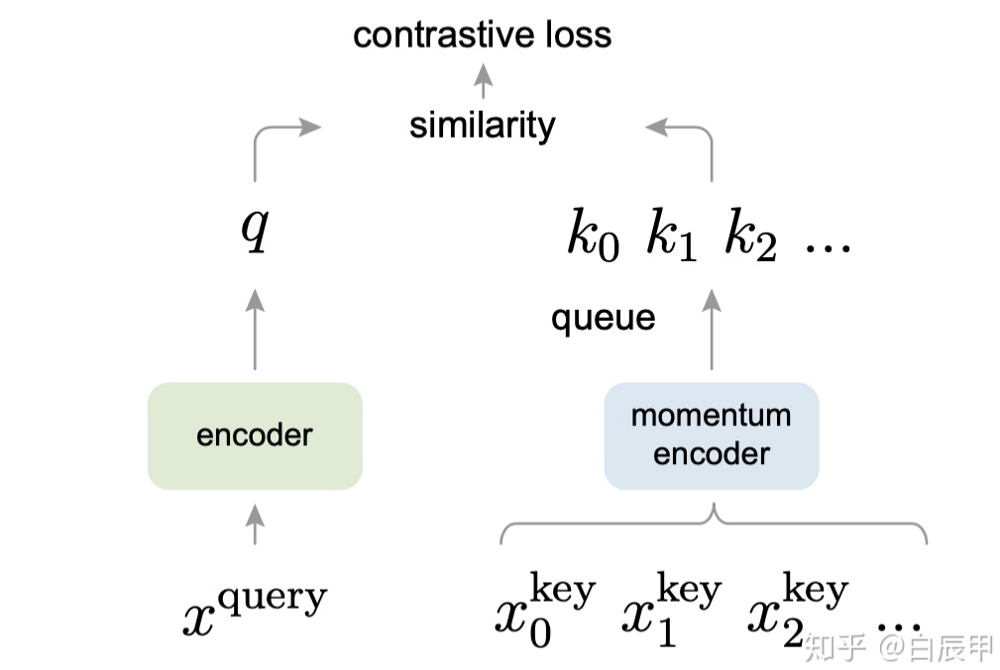
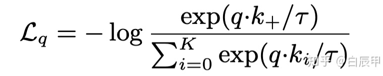
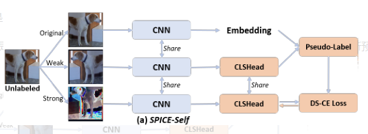
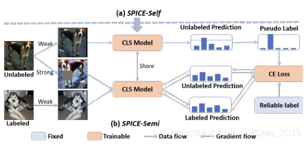

# SPICE: Semantic Pseudo-labeling for Image Clustering

### 1 摘要

### 2 方法

预训练无监督表征学习模型，其卷积网络提取的嵌入式特征用于生成伪标签训练分类模型(SPICE-Self, SPICE-Semi), 最后分类网络实现预测簇的类别

#### 2.1 moco表征学习

##### 2.1.1 对比学习

##### 学习一个编码器f，这个编码器f能够拉近x与其正样本间的距离，推远x与其负样本之间的距离



定义了一个**查询样本**和一个队列的 **k** . 在该队列中，一般包含了**单个的 positive 样本和多个 negative 样本**

查询样本记为$x^q$（query），经过 encoder 网络 $f_q$进行编码得到$$q=f_q(x^q)$$ 。随后从队列中采样了K+1个样本$${k^0, ...k^K}$$作为key。这些 key 是用不同的队列 encoder 网络 $$f_k$$进行编码得到的。


##### 2.1.2 loss

InfoNCE:



当 $$k_i!=k_+$$时，表明我们的查询q与 字典中的$$k_i$$不相似，尽量使 分子的值小，当$$k_i==k_+$$ 时，表明查询q与字典中的  $$k_i$$相似，使得的分子值大，这样log里的值会尽可能接近1，从而最小化损失函数。

##### 2.1.3 动态队列

- 队列中存储多个近期用于训练的 batch 的特征向量。

- 队列在不断的进行更新，新的训练batch入队列后，最老的训练batch 出队列。

- 这里入队的并不是图像本身，而是图像特征

- 本文使用一种 Momentum 更新的方式来更新$$f_k$$，其参数是对 Query Encoder 的平滑拷贝：

  $$\theta_k = m\theta_k + (1-m)\theta_q$$

  $$m=0.999$$

- 用于 negative 采样的队列是动态的
- 由于$$f_k$$的变化非常缓慢，因此虽然 $${\{k^0, ...k^K\}}$$是通过不同 encoder 编码的，编码器导致的差异会非常小
- 与Memory Bank类似，NCE 产生的损失并不影响 $$f_k$$，只影响 $$f_q$$

>用于 negative 样本特征提取的编码器与用于query提取的编码器不一致，是一种Momentum更新的关系。而在memory-bank中两个编码器是一致的

##### 2.1.4 shuffle BN

由于 **Batch Normalization** 会带来不良影响，进而提出了 **Shuffling BN** 的方法。

对于 $$f_k$$ 网络，先对所有样本进行打乱，然后将样本分散到多个GPU上，在每个GPU中独立的进行BN操作。

但对$$f_q$$没有这样的操作，因此 $$f_k$$ 和 $$f_q$$在使用BN规约时使用的$$\sigma$$和$$\mu$$ 来自于两个不同的集合

#### 2.2 SPICE-self

设计一个基于伪标签算法的相似性度量。该算法在训练过程中可以动态预测batch-wise的为标签



在每个训练iteration中包含三步：

- 在一个大batch数据上计算嵌入式特征（embedding feature）， 及数据弱变换的语义预测。合并嵌入式特征和预测得到两个矩阵P,F

- 利用P,F对于每个聚类，选出样本属于该类的概率在前$$n_t$$名的样本，以它们的嵌入特征的均值作为聚类中心。
  对聚类中心最近的n个样本赋予伪标签得到$${\{X_t, L_t\}}$$
-  数据$$X_t$$先被强转换至$$X_a$$，固定CNN参数，用$${\{X_a, L_t\}}$$更新CLSHead。选出最小损失$$ L_{DSCE}$$的最佳head

#### 2.3 SPICE-semi

已知聚类结果和嵌入式特征，利用半监督学习范式对分类模型进行再训练，进一步提高聚类性能



SPICE-Self得到了样本、聚类结果、嵌入特征的三元组$$x_i, l_i, f_i$$

- 根据余弦相似性从嵌入特征空间选取相邻的$$n_s$$个样本，计算这些样本中与$$x_i$$属于同一类的比例。比例大于某个阈值时，认为$$x_i$$样本的类别分配是可信的。
- 对有标签数据，计算CLS Model预测结果与标签的交叉熵；对于无标签数据，计算使用CLS Model对强变换的预测结果与弱变换预测的伪标签的交叉熵。损失函数是二者之和

### 3 实现

- Pretrain representation learning model

  ```shell
  python tools/train_moco.py
  ```

  需要修改的文件有：

  `tools/train_moco.py`,

  `spice/model/feature_modules/cluster_resnet.py`,

  `moco/builder.py`

  `moco/aurora.py`

  - train_moco.py

    `--data_type`, `--data`, `--img_size`, `--save_folder`, `--resume`

    `elif args.data_type`,

    `os.enviorn['CUDA_VISIBLE_DEVICES']`

    关于moco文件参数相关参见：https://github.com/facebookresearch/moco

  - cluster_resnet.py

    `in_size`, `avg_pool_sz `, `self.conv1`

  - builder.py

    `input_size`

  - aurora.py

    Dataset class, return [img, target]

- Precompute embedding features

  ```shell
  python tools/pre_compute_ebmedding.py
  ```

  需要查看的文件有：

  `spice.model.build_model_sim.py`， 

  

