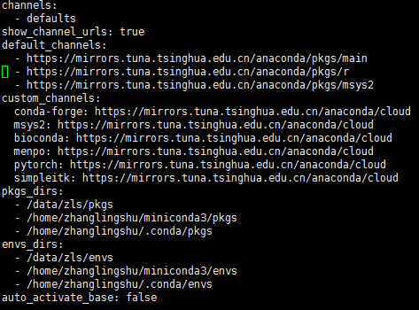
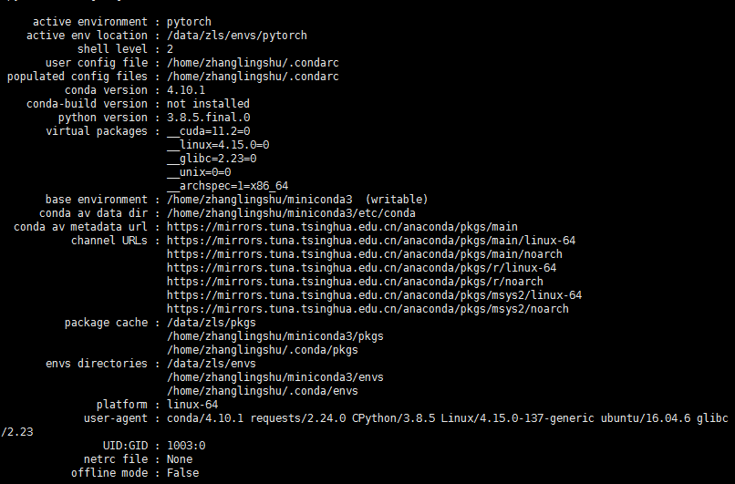

# conda

### conda自定义虚拟环境位置

```bash
conda create --prefix=/xxx/xxx/envs/name python=3.8

conda activate /xxx/xxx/envs/name
```

### conda 修改默认pkgs和envs位置

- 查看原始信息

  ```bash
  conda info
  ```

- 修改路径

  ```
  vi ~/.condarc
  ```

  

- 查看

  

### conda clean

删除从不使用的包
```conda clean --packages```

删除tar包
```conda clean --tarballs```

删除索引缓存、锁定文件、未使用过的包和tar包
```conda clean -a ```

清楚索引缓存

```conda clean -i```

