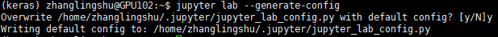

# Jupyter

### jupyter connect server

1. install jupyter on server

```bash
conda install pyzmq tornado jinja2 jsonschema jupyterlab
```

2. config file

```bash
jupyter lab --generate-config
```



3. generate psswd

```python
python
from IPython.lib import passwd
passwd()

>>>'sha1:315f33a4f10e:f3d639b955ef090ee70bcd09d6fe0a83750611df'
```

4. change config

```bash
vi /home/zhanglingshu/.jupyter/jupyter_lab_config.py
```

​	文末添加：

```
'sha1:315f33a4f10e:f3d639b955ef090ee70bcd09d6fe0a83750611df'
c.NotebookApp.ip='*'
c.NotebookApp.password=u'sha1:11482904e637:fc8a256c3be0958dbdde3755754e79ed6b604d19'
c.NotebookApp.open_browser = False
c.NotebookApp.port = 9001
c.InteractiveShellApp.matplotlib ='inline'
```

5. Xshell 配置

   文件->属性->SSH->隧道

   添加侦听端口：9001

   目标主机：服务器IP

   目标端口：9001

6. run 

```bash
jupyter lab
```

​	浏览器：```localhost:9001```

### jupyter multi envs

1. 在需要的虚拟环境中安装ipykernel

   ```bash
   conda install ipykernel
   ```

2. 安装menus

   ```bash
   python -m ipykernel install --user --name keras --display-name "Python (keras)"
   ```

3. 刷新jupyterlab
