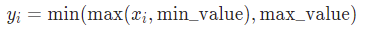

# ```import torch```

### torch.clamp()

```torch.clamp(input, min, max, *, out=None) → Tensor```



```python
>>> a = torch.randn(4)
>>> a
tensor([-1.7120,  0.1734, -0.0478, -0.0922])
>>> torch.clamp(a, min=-0.5, max=0.5)
tensor([-0.5000,  0.1734, -0.0478, -0.0922])
```

