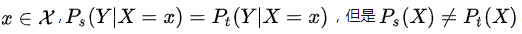
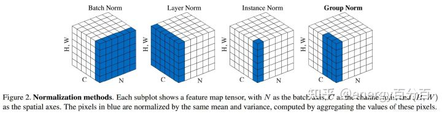
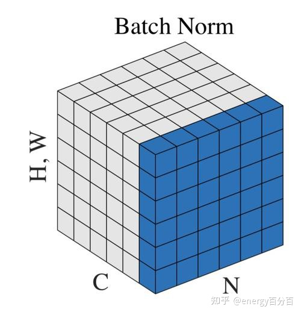
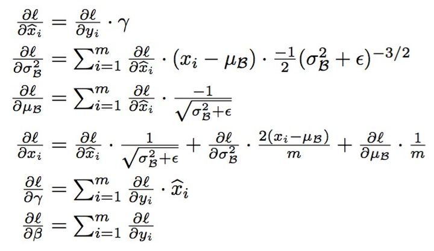
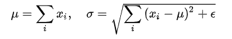
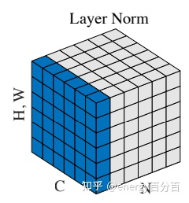
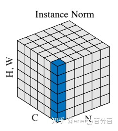

# Normalization

### 1 深度学习中的ICS

#### 1.1 深度学习模型学习困难的一个原因

- 多层网络叠加
- 每一层的参数更新导致上层输入分布发生变化
- 高层输入分布变化剧烈，不断重新适应底层参数更新

#### 1.2 ICS(Internal covariate shift)

- 统计机器学习中的**一个经典假设**：

  ==**“源空间(source domain)和目标空间(target domain)的数据分布(distribution是一致的“**==

- **covariate shift**：分布不一致假设之下的一个分支问题。它是指

  ==**源空间和目标空间的条件概率是一致的，但是其边缘概率不同**==

  

- ICS：神经网络的**各层输出**，由于经过了层内操作作用，其**分布与各层对应的输入信号分布不同**，且**差异随着网络深度增大而增大**，可是它们**所能“指示”的样本标记（label）仍然是不变的**。 层间信号的分析，所以叫internal。

#### 1.3 ICS导致问题

- 每个神经元的输入数据不再是独立同分布的
- 上层参数需要不断适应新的输入数据分布，降低学习速度。
- 下层输入的变化可能趋向于变大或者变小，导致上层落入饱和区，学习过早停止

### 2 各种Normalization

#### 2.1 Normalization的基本思想

> 由于ICS，每层x的分布相差可能很大。BN等Normalization简化的白化操作解决。

- 在x送给神经元前，先做**平移和伸缩变换**， 将x的**分布规范化**成固定区间范围的**标准分布**

- 通用框架

  ![[公式]](https://www.zhihu.com/equation?tex=h%3Df%5Cleft%28%5Cbold%7Bg%7D%5Ccdot%5Cfrac%7B%5Cbold%7Bx%7D-%5Cbold%7B%5Cmu%7D%7D%7B%5Cbold%7B%5Csigma%7D%7D%2B%5Cbold%7Bb%7D%5Cright%29%5C%5C)
  - μ，b为平移缩放参数，得到的数据符合**均值为 0、方差为 1** 的标准分布

  - g，b为再平移再缩放参数，最终得到的数据**均值为b, 方差为g^2^** 

    ==保证模型的表达能力不因规范化而下降==

    - b, g可学习。充分利用**底层神经网络的学习能力**
    - 保证获得**非线性表达能力**。*第一步让数据落在激活函数的线性区，表达能力下降*
    - 让normalization有可能还原最初的输入

  - 不会跟没变一样

    - 原参数x的均值由下层神经网络复杂关联， 现由b决定。b可学习，去除与下层计算的密切耦合

#### 2.2 BatchNormalization

- 描述

- 示意图

  

- BN计算

  

  > BN应用在非线性映射前

- 细节
  - BN针对单个维度 element-wise的计算
    - input: NxCxHxW
    - 均值：对每个channel的图求像素和再除以1/(NxHxW) 
  - 要求每个mini-batch间及和整体数据是近似同分布的
  - 每个mini-batch分布差距很大增加模型训练难度
  - 充分shuffle， mini-batch较大
  - 针对单个神经元可训练的

- 作用
  - 加快收敛速度

  - 防止梯度消失：数据在进入激活函数敏感的区域

    > 梯度消失：当输入过大或者过小，经过sigmoid函数后输出范围就会变得很小，而且反向传播时的梯度也会非常小。由于网络的前端比后端求梯度需要进行更多次的求导运算，最终会出现网络后端一直学习，而前端几乎不学习的情况

  - 控制梯度爆炸：BN后权值更新不会过大？

  - 增加精度

  - 增加鲁棒性

    > 分布差距较小的mini-batch看作为规范化和模型训练引入噪声

  - 防止过拟合（正则化作用）

    > 同样一个样本的输出不再仅仅取决于样本的本身，也取决于跟这个样本同属一个batch的其他样本，而每次网络都是随机取batch

#### 2.3  Layer Normalization

- 描述

  综合考虑一层所有维度的输入，计算该层的平均输入值和输入方差。所有输入共享一个规范化

  

- 示意图

  

- 细节

  - 针对单个样本，所有维度，1/CxHxW
  - 避免受nimibatch分布的影响
  - 不需要保存 mini-batch 的均值和方差
  - 适用于小mini-batch场景、动态网络场景和 RNN（NLP）

#### 2.4 Instance Normalization

- 描述

  对一个样本中的每一个通道进行单独的标准化操作

- 示意图

  

- 细节
  - 用于风格化迁移
  - 不适用于要用到特征图相关性的情况

### 3 Normalization 有效的原因

#### 3.1 权重伸缩不变性

- 避免权重过大过小导致的梯度消失/爆炸，加速网络训练

  ![[公式]](https://www.zhihu.com/equation?tex=%5Cbold%7BW%27%7D%3D%5Clambda%5Cbold%7BW%7D)

  推导

  ![[公式]](https://www.zhihu.com/equation?tex=Norm%28%5Cbold%7BW%27x%7D%29%3DNorm%5Cleft%28%5Cbold%7Bg%7D%5Ccdot%5Cfrac%7B%5Cbold%7B%5Cbold%7BW%27x%7D%7D-%5Cbold%7B%5Cmu%27%7D%7D%7B%5Cbold%7B%5Csigma%27%7D%7D%2B%5Cbold%7Bb%7D%5Cright%29%5C%5C%3DNorm%5Cleft%28%5Cbold%7Bg%7D%5Ccdot%5Cfrac%7B%5Clambda%5Cbold%7BWx%7D-%5Clambda%5Cbold%7B%5Cmu%7D%7D%7B%5Clambda%5Cbold%7B%5Csigma%7D%7D%2B%5Cbold%7Bb%7D%5Cright%29%5C%5C%3DNorm%5Cleft%28%5Cbold%7Bg%7D%5Ccdot%5Cfrac%7B%5Cbold%7BWx%7D-%5Cbold%7B%5Cmu%7D%7D%7B%5Cbold%7B%5Csigma%7D%7D%2B%5Cbold%7Bb%7D%5Cright%29%3DNorm%28%5Cbold%7BWx%7D%29%5C%5C)

  提高反向传播的效率

  ![[公式]](https://www.zhihu.com/equation?tex=%5Cfrac%7B%5Cpartial+Norm%28%5Cbold%7BW%27x%7D%29%7D%7B%5Cpartial+%5Cbold%7Bx%7D%7D+%3D+%5Cfrac%7B%5Cpartial+Norm%28%5Cbold%7BWx%7D%29%7D%7B%5Cpartial+%5Cbold%7Bx%7D%7D+%5C%5C)

  ==权重的伸缩变化不会影响反向梯度的 Jacobian 矩阵，因此对反向传播没有影响==

- 参数正则化的效果

  ![[公式]](https://www.zhihu.com/equation?tex=%5Cfrac%7B%5Cpartial+Norm%28%5Cbold%7BW%27x%7D%29%7D%7B%5Cpartial+%5Cbold%7BW%27%7D%7D+%3D%5Cfrac%7B1%7D%7B+%5Clambda%7D%5Ccdot+%5Cfrac%7B%5Cpartial+Norm%28%5Cbold%7BWx%7D%29%7D%7B%5Cpartial%5Cbold%7BW%7D%7D+%5C%5C)

  ==下层的权重值越大，其梯度就越小，参数的变化就越稳定==，相当于正则化

#### 3.2 数据伸缩不变性

- ==减小梯度弥散，简化学习率的选择==

![[公式]](https://www.zhihu.com/equation?tex=Norm%28%5Cbold%7BW%7D%5Cbold%7Bx%27%7D%29%3DNorm%28%5Cbold%7BW%7D%5Cbold%7Bx%7D%29%5C%5C)

![[公式]](https://www.zhihu.com/equation?tex=%5Cbold%7Bx%27%7D%3D%5Clambda%5Cbold%7Bx%7D)

> 梯度弥散：![[公式]](https://www.zhihu.com/equation?tex=h_l%3Df_%7B%5Cbold%7BW%7D_l%7D%28%5Cbold%7Bx%7D_l%29%3Df_%7B%5Cbold%7BW%7D_l%7D%28f_%7B%5Cbold%7BW%7D_%7Bl-1%7D%7D%28%5Cbold%7Bx%7D_%7Bl-1%7D%29%29%3D%5Ccdots%3D%5Cbold%7Bx%7D_0%5Cprod_%7Bk%3D0%7D%5El%5Cbold%7BW%7D_k%5C%5C)
>
> 每一层神经元的输出依赖于底下各层的计算结果。没有正则化，当下层输入发生伸缩变化时，经过层层传递，可能会导致数据发生剧烈的膨胀或者弥散

​	加入norm后，对某层神经元，输入永远保持标准分布， **数值变化不影响权重参数更新**

![[公式]](https://www.zhihu.com/equation?tex=%5Cfrac%7B%5Cpartial+Norm%28%5Cbold%7BWx%27%7D%29%7D%7B%5Cpartial+%5Cbold%7BW%7D%7D+%3D+%5Cfrac%7B%5Cpartial+Norm%28%5Cbold%7BWx%7D%29%7D%7B%5Cpartial%5Cbold%7BW%7D%7D+%5C%5C)