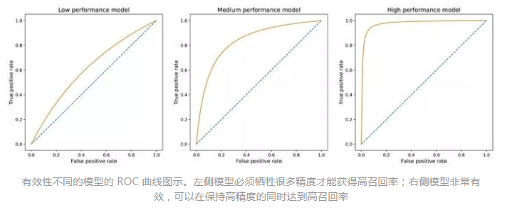
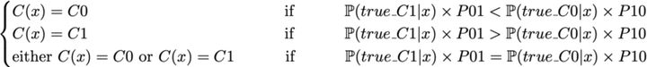

# 样本类别不均衡

### 1 检测naive behaviour

- 混淆矩阵

  |          |      |  GT  |  GT  |
  | :------: | :--: | :--: | :--: |
  |          |      |  P   |  N   |
  | **PRED** |  P   |  TP  |  FP  |
  | **PRED** |  N   |  FN  |  TN  |

- Acc、Precision(查准率)、Recall(查全率)
  $$
  accuracy = \frac{TP+TN}{TP+TN+FP+FN} 
  $$

  $$
  precision = \frac{TP}{TP+FP}
  $$

  $$
  recall = \frac{TP}{TP+FN}
  $$

  $$
  F1_{score} = \frac{2}{\frac{1}{precision}+\frac{1}{recall}}
  $$

  |              |            高查准率            |           低查准率           |
  | :----------: | :----------------------------: | :--------------------------: |
  | **高查全率** |         很好的检测该类         | 很好的检测该类、判断可信度低 |
  | **低查全率** | 不能很好的检测该类、但判断可信 |      不能很好的检测该类      |

- ROC、AUROC
  $$
  when\;P(C|x)\geq T, x \ is \ classifed \ as \ C
  $$
  当T=1时，模型仅100%可信才将x分到C。

  当T=0时，每个点都标注为C。

  - ROC：T从0->1变化的(FPR, TPR)曲线。牺牲查准率提高查全率
  - AUROC: area under ROC, ==AUROC-->1好==

  
  $$
  TPR = recall
  $$

  $$
  FPR = 1-precision
  $$

### 2 解决

#### 2.1 数据层面解决

- 扩大数据集
- 重采样
  - 过采样：对小类的数据样本进行采样，增加小类的数据样本个数（采样数大于该类样本数）
  - 欠采样：对大类的数据样本进行采样，仅保留这些样本点的一部分
  - 随机采样/非随机采样
  - 采样比例接近现实情况
- 人工产生数据样本：从少数类创建新的合成点，以增加其基数

#### 2.2 算法层面解决

- 基于cost

  对分类loss加权。P01为真实为1分类为0的cost

  

- 基于异常检测

  将小样本作为异常点

- 不同的分类算法

  决策树在类别不均数据上表现不错