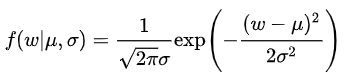

# 过拟合

### 1 表现及原因

- 表现：复杂模型在训练时将抽样误差也考虑在内进行拟合，经验误差小，泛化误差发
- 原因：数据太少+模型太复杂。机器学习中模型的拟合能力一般远远高于问题复杂度

### 2 防止过拟合

##### 2.1 获取更多数据

- 源头获取更多数据
- 根据数据集估计分布参数，利用分布产生数据（少用，也引入抽样误差）
- 数据增强

##### 2.2 使用合适的模型

- 网络结构：减少层数、神经元个数等

- early stopping

- 限制权值（正则化）

  ==正则化之所以有效，是因为其降低了特征的权重，使得模型更为简单==

  - L1正则

    - 对LR来说

      本质：为模型增加了==模型参数服从零均值拉普拉斯分布==这一先验

      推导：

      拉普拉斯分布

      似然函数：

      求负对数：

    - 神经网络
      $$
      Loss = loss + \frac{\lambda}{n}\sum_i{|w_i|}
      $$
      求导:
      $$
      \frac{\alpha Loss}{\alpha w}=\frac{\alpha loss}{\alpha w} +\frac{\lambda}{n}sgn(w)
      $$
      权重更新：
      $$
      w' = w-\frac{\eta\lambda}{n}sgn(w)-\eta\frac{\alpha loss}{\alpha w}
      $$
      w=0, |w|不可导，按未正则化更新w

      w<0, w增大。反之减小。

      ==使得网络权重尽可能为0，减小网络复杂度，防止过拟合==

  - L2正则

    - 对LR来说

      本质：为模型增加了==w 服从零均值正态分布==这一先验

      推导：

      正态分布：

      似然函数：

      

      求负对数：

    - 神经网络
      $$
      Loss = loss + \frac{\lambda}{2n}\sum_i{w_i^2}
      $$
      求导：
      $$
      \frac{\alpha Loss}{\alpha w}=\frac{\alpha loss}{\alpha w} +\frac{\lambda}{n}w
      $$
      权重更新：
      $$
      w' = (1-\frac{\eta\lambda}{n})w-\eta\frac{\alpha loss}{\alpha w}
      $$
      系数小于1， w逐渐靠近0

      ==也叫weight decay==

  - Dropout

    以一定的概率，随机将一部分神经元激活函数设为0
    
    - 相当于产生不同的训练模型
    - 降低网络对单个神经元的依赖，提高泛化能力
    
  - [BatchNorm](D:\typora\typora_notes\神经网络理论相关\Normalization.md)

- 增加噪声

  - 输入增加噪声：噪声随网络传播，按权值平方放大对误差产生影响

    

  - 权值加噪声

    初始化网络的时候，用0均值的高斯分布作为初始化（L2）

  - 对网络的响应加噪声：在前向传播过程中，让神经元的输出变为 binary 或 random（**测试集上有效**）

- 结合多种模型

  - Dropout

  - [Bagging（Bootstrap aggregating）](D:\typora\typora_notes\神经网络理论相关\集成学习.md)

  - [Boosting](D:\typora\typora_notes\神经网络理论相关\集成学习.md)

  - [Stacking](D:\typora\typora_notes\神经网络理论相关\集成学习.md)

