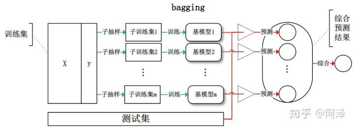
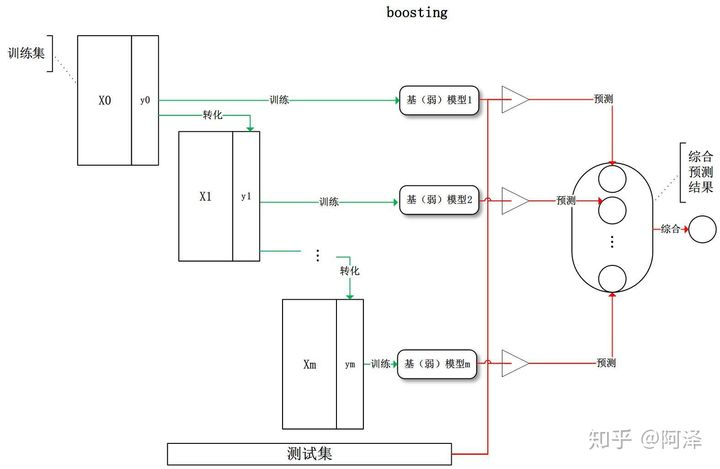
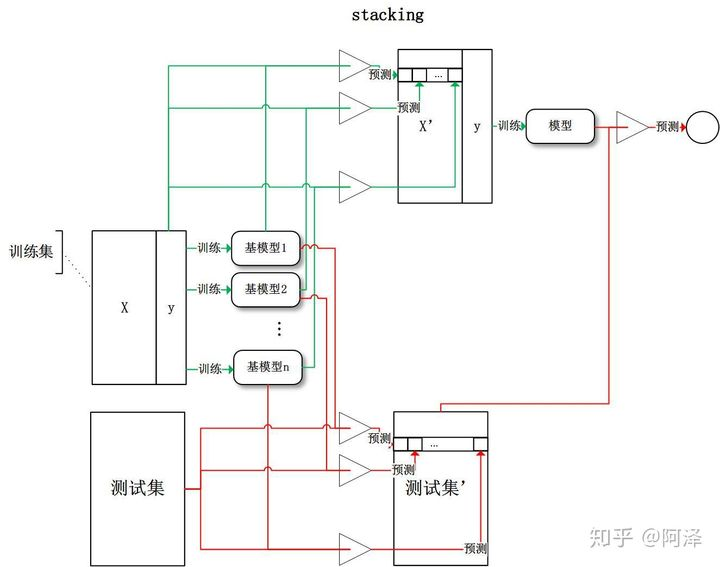

# 集成学习

### 1 Bagging

#### 1.1 概要

- 有放回子抽样
- 综合所有基学习器预测值（投票法）
- 偏差高、方差低
  - 整体模型的**期望等于基模型的期望**， 所以**基模型为强模型**
  - 整体模型的**方差小于等于基模型的方差**，**基模型**数量**增多**，整体模型的**方差减少**，从而**防止过拟合**的能力增强，模型的准确度得到提高

#### 1.2 Random Forest

### 2 Boosting

#### 2.1 概要

- 模型训练有顺序
- 在前一个基模型基础上学习
- 综合所有预测（加权法）
- 偏差低、方差高
  - 整体模型的**方差等于基模型的方差**， 弱模型方差小所以**基模型为弱模型**，防止过拟合
  - 基于**贪心策略**的**前向加法**，整体模型的**期望由基模型的期望累加**而成，所以随着**基模型数增多**，整体模型的**期望值增加**，整体模型的**准确度提高**

#### 2.2 GBDT（Gradient Boosting Decision Tree ）

#### 2.3 Adaboost

- 算法步骤
  - 初始化训练样本的权值分布，每个样本具有相同权重；
  - 训练弱分类器，如果样本分类正确，则在构造下一个训练集中，它的权值就会被降低；反之提高。用更新过的样本集去训练下一个分类器；
  - 每一轮中加入一个新的弱分类器，直到达到某个预定的足够小的错误率或达到预先指定的最大迭代次数
  - 将所有弱分类组合成强分类器，各个弱分类器的训练过程结束后，加大分类误差率小的弱分类器的权重，降低分类误差率大的弱分类器的权重。
- 细节
  - **加法模型**：最终的强分类器由若干个弱分类器加权平均得到
  - **指数loss**
  - 正则化向防止过拟合（步长）
  - 最大迭代次数和步长共同决定拟合效果
- 优点
  - 分类精度高
  - 用各种回归分类模型来构建弱学习器，灵活；
  - 不容易过拟合
- 缺点
  - 对异常点敏感

### 3 Stacking

- 用全部数据训练好基模型
- 每个基模型对每个训练样本预测
- 预测值作为训练样本特征值，得到新的训练样本
- 基于新的训练样本训练模型得到预测
- 偏差低、方差高