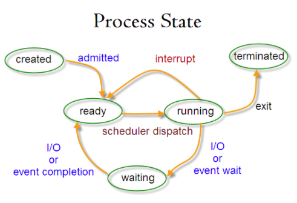
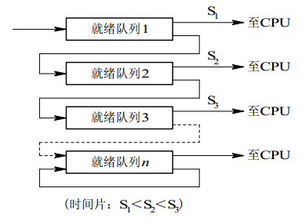
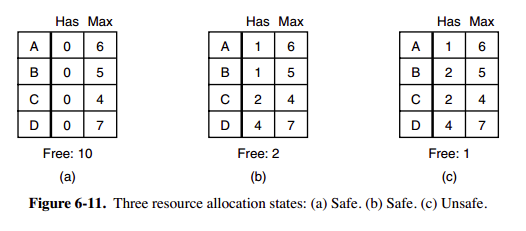
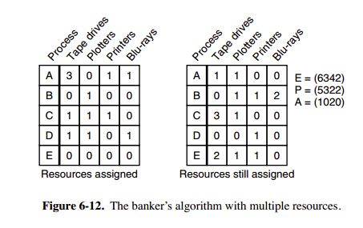
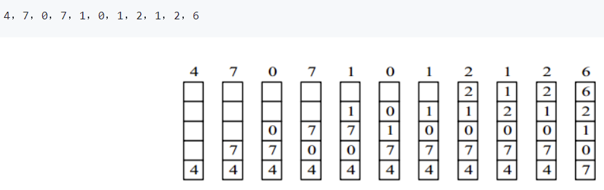
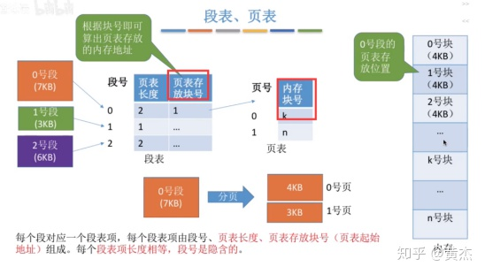

### 一、概述

#### 1.基本特征

- 并发：进程、线程。同时运行多个程序
- 并行：硬件支持。同时执行多个指令

- 共享
  - 互斥共享（临界资源）
  - 同时共享

- 虚拟
  - 时分复用：多个进程在统一处理器上并发
  - 空分复用：虚拟存储

- 异步

#### 2. 基本功能

- 进程管理：控制、同步、通信、死锁、处理机制调度
- 内存管理：内存分配、地址映射、内存保护/共享、虚拟内存
- 文件管理：存储空间管理、目录管理、文件读写
- 设备管理：缓冲、分配、虚拟设备

#### 3. 系统调用

一个进程从用户态到内核态

Linux系统调用：

- 进程控制、通信
- 文件操作
- 设备维护
- 信息维护
- 安全

#### 4. 宏内核、微内核

#### 5. 中断

- 外中断：CPU执行指令以外的事件
- 异常：CPU......以内....
- 陷入：用户程序中使用系统调用

### 二、进程线程

#### 1. 概念

<table>
    <tr>
        <td> </td>
        <td>进程</td>
        <td>线程</td>
    </tr>
    <tr>
        <td>基本概念</td>
        <td>资源分配的基本单位</td>
        <td>进程中执行运算的最小单位、独立调度的基本单位</td>
    </tr>
    <tr>
        <td>优点</td>
        <td>/</td>
        <td>易于调度、提高并发性、开销少、利于充分发挥多处理器的功能</td>
    </tr>
    <tr>
        <td>关系</td>
        <td colspan="2">
            1.一个线程只属于一个进程，一个进程至少有一个线程 
            2.同一进程的所有线程共享该进程的所有资源 
            3.处理机上运行的是线程 
            4.线程在执行过程中，需要协作同步.
        </td>
    </tr>
    <tr>
        <td>区别</td>
        <td colspan="2">
            1.调度：线程为调度和分配的基本单位，进程为拥有资源的基本单位 
            2.并发性：进程之间可以并发执行，同一个进程的多个线程之间也可并发执行 
            3.拥有资源：线程不拥有系统资源，但可以访问隶属于进程的资源. 
            4.系统开销：在创建或撤消进程时，由于系统都要为之分配和回收资源，导致系统的开销明显大于创建或撤消线程时的开销。
        </td>
    </tr>
</table>

#### 2. 进程切换状态

#### 3. 进程调度算法

- 批处理系统

  - **FCFS**：非抢占式、有利于长期作业
  - **SJF**(shortest job first)：非抢占式、长作业可能饿死
  - **SRTN**(shortest remaining time next)：抢占式。（新作业到达时，其整个运行时间与当前进程剩余时间比较。运行短的）

- 交互式系统

  - **时间片轮转**

    - 效率与时间片大小有关
    - 具体流程
      - 所有ready的进程按FCFS排序
      - 调度时把时间片给队首
      - 时间片用完，队首->队尾，CPU时间给对首

  - **优先级调度**

    - 给进程分配优先级
    - 为防止低级进程等不到调度，可随等待时间增加优先级

  - **多级反馈队列**

    - 为连续使用多个时间片的进程考虑。设置了多个队列（进程排队），每个队列时间片大小都不同
    - 进程在第一个队列没执行完，就会被移到下一个队列
    - 队列优先权也不同，最上面的优先权最高

    

- 实时系统

  - 硬实时
  - 软实时

#### 4. 进程同步

- 临界区：对临界资源访问的代码

- 同步：先后执行

- 互斥：在同一时刻只有一个进程能进入临界区

- 信号量：int

  - **down** : if 信号量> 0 ，执行 -1 操作；if 信号量 = 0，进程睡眠，等待信号量大于 0

  - **up** ：信号量 +1 ，唤醒睡眠的进程让其完成 down 操作
  - **互斥量（mutex）**：取值只能为 0 或者 1。0 表示临界区已加锁，1 表示解锁

#### 5. 进程通信

- 管道：半双工、只能在父子进程或者兄弟进程中使用
- FIFO：命名管道、去除了管道只能在父子进程中使用的限制
- 消息队列
  - 独立于读写进程
  - 避免FIFO的同步阻塞
  - 读进程根据消息类型选择性接收
- 信号量
- 共享存储
- 套接字：不同机器间

### 三、死锁

#### 1. 必要条件

- 互斥
- 占有和等待：已得到某资源 的进程可请求解资源
- 不可抢占
- 环路等待：2或2个以上的进程组成环路、都在等

#### 2. 处理方法

- 鸵鸟策略
- **死锁的检测与恢复**（发生时）
  - 检测：每种类型一个资源检测（有向图环）、每种类型多个资源资源检测
  - 恢复：抢占、回滚、杀死
- **死锁的预防**（运行时）
  - 破坏互斥条件
  - 破坏占有/等待
  - 破坏不可抢占
  - 破坏环路等待

- **死锁的避免**（运行前）

  - 安全状态：如果**没有死锁发生**，并且即使**所有进程**突然请求对资源**的最大需求**，也仍**然存在某种调度次序**能够使得每一个进程运行完毕，则称该状态是安全的

  - 单个资源银行家

    

  - 多个资源银行家

    

### 四、内存管理

#### 1. 虚拟内存

- 目的：物理内存扩充成更大的逻辑内存
- **内存抽象成地址空间**
- 自己的地址空间，地址空间被分割成多个块（**页**）
- 页被映射到物理内存，但**不需要映射**到**连续**的物理内存，也**不需要所有页**都在物理内存中

#### 2. 分页系统地址映射

- 页：**一维**的，程序员只需要给出**一个逻辑地址**

- MMU（内存管理单元）：管理着地址空间和物理内存的转换

  - 页表：**页**（程序地址空间）和**页框**（物理内存空间）的**映射表**。

    

#### 3. 页面置换算法

- 缺页中断：程序运行过程中要访问的页面不在内存中时发生，将页面调入内存

  - **缺页中断次数=进程的物理块数×页面置换次数**
  - 缺页中断率 = 缺页中断次数/引用次数 *100%

- 页面置换：缺页中断+内存已满

- 页面置换算法：

  - 目标：使页面置换频率最低（**缺页率最低**）

  - OPT：换出**最长时间内不再被访问**的页，最低的缺页率

  - FIFO：选择**换出的页面是最先进入的**页面

    > 将那些经常被访问的页面换出，导致缺页率升高。

  - LRU：将**最近最久未使用**的页面换出

    > 每次访问都需要更新链表，因此这种方式实现的 LRU 代价很高

    

  - NRU：最近未使用

    - 每个页面两个状态位：被访问时 R=1，被修改时M=1
    - R定时清零
    - 优先换出已经被修改的脏页面**（R=0，M=1）**，而不是被频繁使用的干净页面（R=1，M=0）

  - 第二次机会算法
    - 当页面**被访问** (读或写) 时设置该页面的 **R 位为 1**
    - 替换时：检查最老页面的 R 位。若 **R=0**，则页面既老又没有用，**立刻置换掉**；否则R=1，则**将 R 位清 0**，并把该页面**放到链表的尾端**，修改它的装入时间使它就像刚装入的一样

  - 时钟：环形链表+指向最老页面的指针

#### 4.分段

- 把每个**表分成段**，**一个段**构成**一个独立地址空间**
- 每个**段的长度可以不同**，并且可以**动态增长**
- **二维**：程序员需要给出**段名和段内地址**

#### 5.段页式

- 地址空间划划分段，每个段上的地址空间划分页
- **每个段对应一个页表**

### 五、设备管理

#### 1. 磁盘

一个磁盘多个**盘面**、一个盘面多个**磁道**、一个磁道多个**扇区**（最小物理存储单位）

#### 2. 磁盘调度算法

- FCFS
  - 优点：公平和简单
  - 缺点：平均寻道时间可能较长
- SSTF（最短寻道时间）：优先调度**与当前磁头所在磁道距离最近**的磁道
  - 优点：平均寻道时间比较低
  - 缺点：不公平、两端的磁道请求更容易**出现饥饿现象**
- SCAN：总是保持一个方向运行，直到该方向没有请求为止，然后改变运行方向

