## 数据库

### 一、 事务

#### 1. ACID

- Atomicity（原子性）：事物为**不可分割**的最小单元
- Consistency（一致性）：数据库在事务**执行前后保持一致性**；所有事务对**数据读取结果相同**
- Isolation（隔离性）：提交前对其它**事务不可见**
- Durability（持久性）：提交后修改永远保留在数据库中；系统崩溃也不丢失执行结果（redo log）

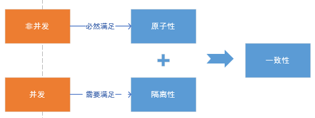

#### 2. 事务 (transaction）

- **访问并可能操作各种数据项**的一个数据库**操作序列** 
- 满足ACID
- commit提交，rollback回滚

### 二、并发一致性

因隔离性难以保证

- 丢失修改

  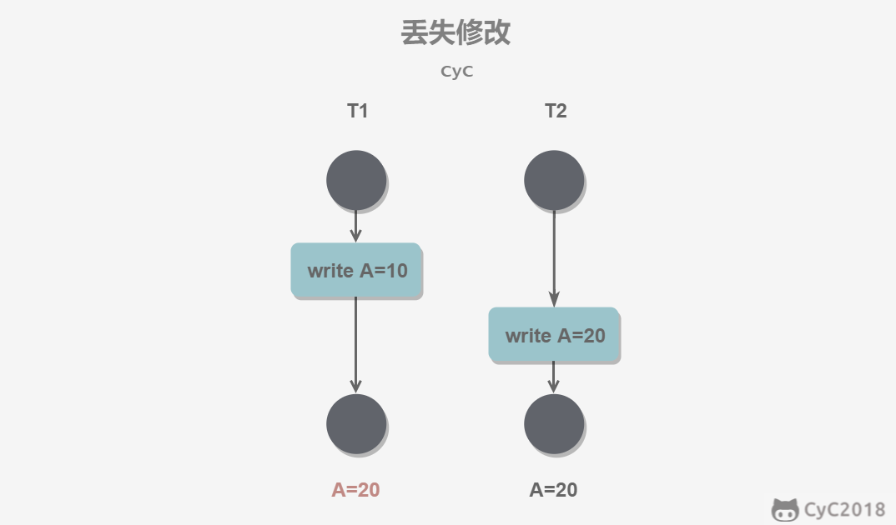

- 读脏数据

  

- 不可重复读

  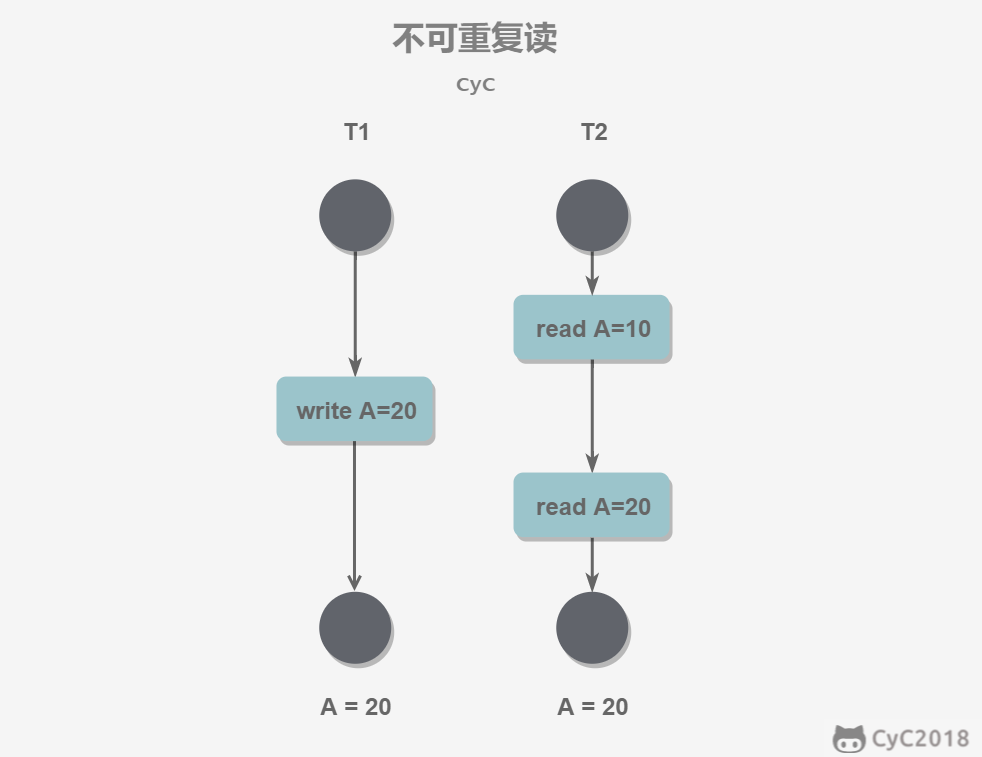

- 幻影读

  

### 三、隔离级别

|                           隔离级别                           | 脏读 | 不可重复读 | 幻影读 |
| :----------------------------------------------------------: | :--: | :--------: | :----: |
| READ UNCOMMITTED （事物中的修改即使未提交也对其它事务可见） |  X   |     X      |   X    |
|  READ COMMITTED （一个事务只能读已提交事务所做的修改）  |  √   |     X      |   X    |
|  REPEATABLE READ （同一事务多次读取同一数据结果一致）   |  √   |     √      |   X    |
|    SERIALIZABLE  （强制事务串行执行（需加锁实现））     |  √   |     √      |   √    |

### 四、关系数据库

#### 1. 函数依赖

- 函数依赖： 关系中不存在两个元组在$A$上属性相等但在$B$上属性不等，$$A\rightarrow B$$
- 部分函数依赖：$$A\rightarrow B$$, 有$$A' \subset B$$使得$A'\rightarrow B$
- 完全函数依赖：$$A\rightarrow B$$, 没有$$A' \subset B$$使得$A'\rightarrow B$
- 传递函数以来：$$A\rightarrow B, B\rightarrow c, \Longrightarrow A\rightarrow C$$
- 平凡函数依赖：$$A\rightarrow B$$，且$$B \subset A$$
- 非平凡函数依赖

#### 2. 多值依赖

- 多值依赖： 设有关系模式$R(U)$，$U$是属性全集，$A，B，Z$是属性集$U$的子集，且$Z=U-A-B$，如果对于R的任一关系，对于$A$的一个确定值，存在$B$的一组值与之对应，且$B$的这组值仅仅决定于$A$的值而与$Z$值无关,此时称$B$多值依赖于$A$，记作$A→→B$
- 平凡的多值依赖：$Z=\phi $，$A→→B$
- 非平凡的多值依赖：$Z\neq \phi $，$A→→B$
- 嵌入性多值依赖：如果在$R(U)$上有$A→→B$在属性集$W(W\subset U)$上成立，则称$A→→B$为$R(U)$的嵌入型多值依赖

#### 3. 键（码）、属性

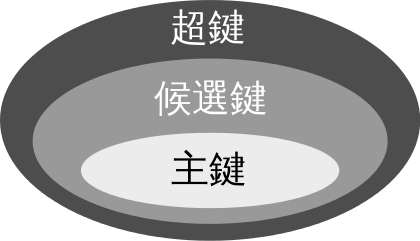

- 超码：能够唯一标示多元组（即“行”）的属性集
- 候选码：超码 + 属性集合中无真子集能成为超码（不含有多余属性的超码）
- 主码：候选码中选一个
- 外码：表A的主键在表B中作为属性，关联A和B。该属性为表B的外码

- 主属性：所有候选码对应的属性
- 非主属性：不包含在任何候选码的属性

- 实体完整性原则：**如果属性**（一个或者一组属性）**是**基本关系R的**主属性**，则**不能取空值**

#### 4. 范式

| 范式类型 |                             描述                             | 解决问题             |
| :------: | :----------------------------------------------------------: | -------------------- |
|   1NF    |                        每个属性不可分                        | 删除、插入、更新异常 |
|   2NF    | 1NF + 消除了非主属性对候选码的部分函数依赖 （主码确定其他属性也确定） (every non-key attribute is fully dependent on primary key) |                      |
|   3NF    | 2NF + 消除了非主属性对候选码的传递函数依赖 （任何非主属性不依赖于其它非主属性） （has no transitive functional dependency） |                      |
|   BCNF   |    3NF + 消除**主属性**对于**候选码**的部分与传递函数依赖    |                      |
|   4NF    | BCNF + 消除非平凡且非函数依赖的多值依赖 （may not contain more than one multi-valued attribute） （删除同一表内的多对多关系） |                      |

- ->1NF

  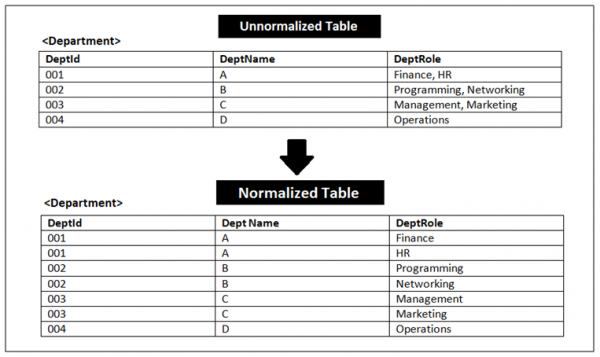

- 1NF->2NF

  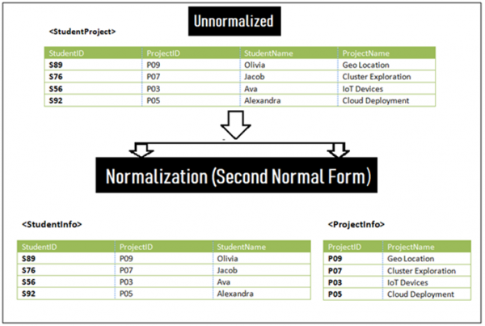

  - unornalized：

    (StudentID, ProjectID)->StudentName

    (StudentID, ProjectID)->ProjectName

    StudentID->StudentName

    ProjectID->ProjectName

    **primary key：**(StudentID, ProjectID)

  - normalized：

    table1：(StudentID, ProjectID)->StudentName

    table2：ProjectID->ProjectName

- 2NF->3NF

  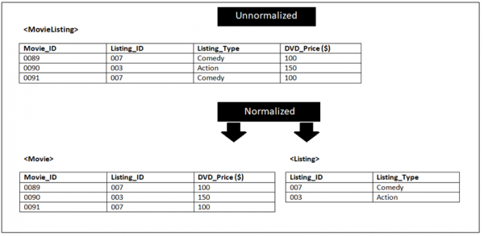

  - unornalized：

    Movie_ID->Listing_ID

    Movie_ID->Listing_Type

    Movie_ID->DVD_Price

    Listing_ID->Listing_Type

    **primary key：**Movie_ID

  - normalized：

    table1：Movie_ID->Listing_ID; Movie_ID->DVD_Price

    table2：Listing_ID->Listing_Type

- 3NF->BCNF

  `STJ(S，T，C)`

  S表示学生，T表示教师，C表示课程(每一教师只教一门课)

  `(S，C)→T，(S，T)→C，T→C`

  候选码：`(S，C)、(S，T)`

  主属性：`S,C,T`

  **不满足BCNF的函数依赖：**T->C

  分解为：`{S,T}, {T, C}`

#### 5. 异常

- 冗余数据
- 插入异常
- 删除异常
- 更新异常

### 五、E-R图

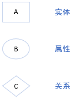

#### 1. 实体的三种关系

- 1v1： 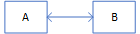
- 1vn： 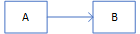(NA v 1B)
- nvn： 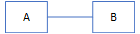

#### 2. 表示多次出现的关系

一个实体在联系出现几次，就要用几条线连接

#### 3. 联系多向性

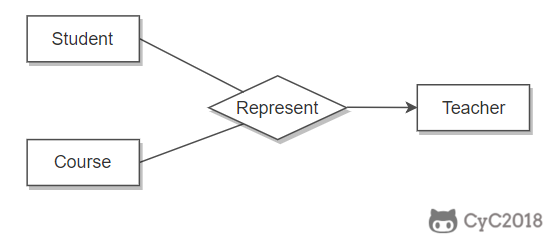

#### 4. 子类

硕士是学生的子类，与子类有关的属性和联系都连到子类上，而与父类和子类都有关的连到父类

### 五、补充

