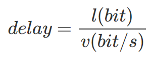
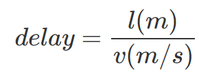
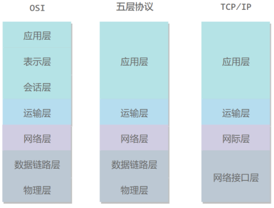
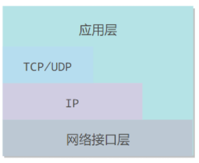
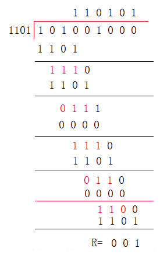
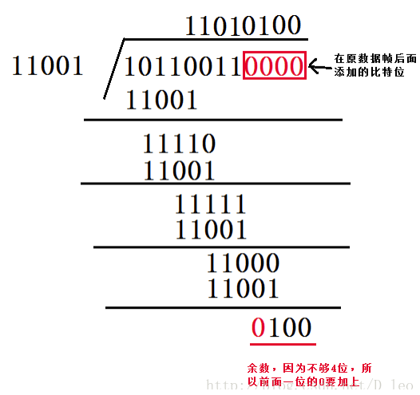
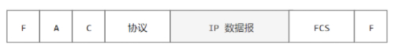
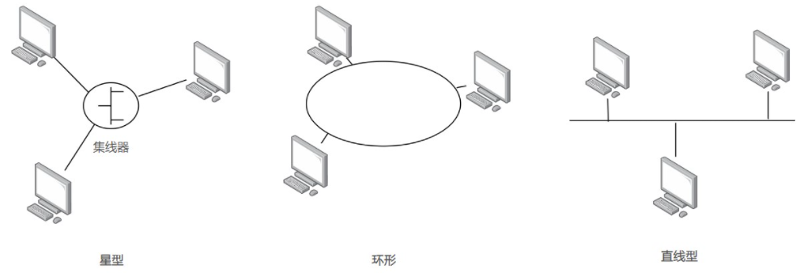
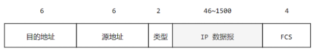
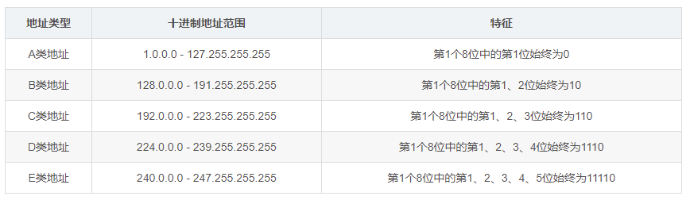

### 一、概述

#### 1. 概念

- 网络、互联网

  网络连接主机、互联网连接网络

- ISP（Internet Service Provider）

  > 目前的互联网是一种多层次 ISP 结构，ISP 根据覆盖面积的大小分为**第一层 ISP、区域 ISP 和接入 ISP**

- 主机间通信方式

  - 客户-服务器（C/S）
  - 点对点（P2P）：不区分客户和服务器

#### 2. 电路交换与分组交换

- 电路交换

  用于**电话通信系统**

  两个用户**通信前建立一条专用物理链路**，且在**整个通信过程中始终占用**该链路

  电路交换**对线路利用率低**，往往不到 10%

- 分组交换

  有**首部和尾部**，包含源地址和目的地址等控制信息

  同**一个传输线路**上同时**传输多个分组**互相不会影响

  分组交换**不占用传输线路**

#### 3. 时延

```总时延 = 排队时延 + 处理时延 + 传输时延 + 传播时延```

- 排队时延

  分组在路由器的输入队列和输出队列中**排队等待**的时间，**取决于网络当前的通信量**

- 处理时延

  主机或路由器收到分组时进行**处理所需**的时间

- 传输时延

  主机或路由器**传输数据帧**所需要的时间

  

  l：数据帧长度

  v：传输速度

- 传播时延

  电磁波**在信道中传播**所需要花费的时间

  

  l： 信道长度

  v： 电磁波在信道上的传播速度

#### 4. 计网结构



- 五层协议
  - 物理层：怎样在传输媒体上传输数据**比特流**，尽可能**屏蔽传输媒体和通信手段的差异**
  - 数据链路层：为**同一链路的主机**提供数据传输服务。把网络层传下来的分组封装成**帧(frame)**
  - 网络层：为**主机**提供数据传输服务。把传输层传递下来的报文段或者用户数据报封装成**分组(packet)**
  - 传输层：为**主机中的进程**提供数据传输服务。
    - 传输控制协议 TCP：完整性服务。面向连接、可靠的，**报文段(segment)**
    - 用户数据报协议 UDP：及时性服务。无连接、尽最大努力的，**用户数据报**
  - 应用层：为**特定应用程序**提供数据传输服务。 HTTP、DNS ，**报文(message)**

- OSI

  - 会话层：建立管理会话
  - 表示层：数据压缩、加密、描述

- TCP/IP

  **应用层可能会直接使用 IP 层或者网络接口层**

  

- 传输过程

  向下加首尾，向上拆首尾

### 二、物理层

- 三种通信方式
  - 单工通信：单向传输
  - 半双工通信：双向交替传输
  - 全双工通信：双向同时传输

### 三、数据链路层

- 差错检查：循环冗余检验（CRC）

  - 概念：**在传输数据后加上一些冗余的码字**，如果接收方能够通过它们直接纠正错误，那么我们就称之为纠错码（Error Correcting Code）。如果接收方仅能通过它们发现错误，而真正纠正错误的过程需要通知发送方进行重传，那么我们就称之为检错码（Error Detecting Code）

  - 用最小的代价，检测（纠正）最多的错误

  - 例1：

    $$M=101001,P=1101,n=3$$

    发送端:

    - $$M=(2^n*M)=101001000$$
    - $$M/P$$(异或)

    

    - $$M=101001000+FCS=101001001$$

    接收端：

    - 接受到的数据以帧为单位进行CRC校验

    - 每一个帧都除以同样的除数P，然后检查余数R，R=0则没有差错

  - 例2：

    CRC生成多项式为$$G(X) = x4 + x3 + 1$$，要求出二进制序列$$10110011$$的CRC校验码

    - 多项式转二进制：$$P = 11001$$

    - $$M=101100110000$$

    - $$M$$除以$$P$$求余

      

- 信道

  - 信道分类

    - 广播：所有的节点都在同一个广播信道上发送数据。
      - 2种控制方法进行协调：**信道复用技术、 CSMA/CD 协议**
    - P2P
      - 使用 **PPP 协议**进行控制

  - 信道复用技术

    - 频分复用（利用率不高）
    - 时分复用（利用率不高）
    - 统计时分复用：不固定每个用户在时分复用帧中的位置，只要有数据就集中组成统计时分复用帧发送
    - 波分复用：光的频分复用
    - 码分复用
      - 每个用户分配 **m bit 的码片**，且码片**正交**：$$ \frac{1}{m}\vec{s}·\vec{m}=0$$
      - 发送端发送**比特1和S**, 发送比特**0和S的反码**
      - 当接收端使用码片$$\vec{s}$$对接收到的数据进行**内积运算**时
        - 结果为 0 ：**其它用户发送的数据**
        - 结果为 1 ：**用户发送的比特 1**
        - 结果为 -1 ：**用户发送的比特 0**

  - CSMA/CD ：载波监听多点接入 / 碰撞检测

    - **多点接入** ：说明这是**总线型网络**，许多主机以多点的方式连接到总线上。
    - **载波监听** ：每个主机都必须**不停地监听信道**。在发送前，如果监听到信道正在使用，就必须等待。
    - **碰撞检测** ：在发送中，如果监听到信道已有其它主机正在发送数据，就表示发生了碰撞
      - **争用期：2τ**。记端到端传播时延为τ(最先发送的站点最多经过 2τ 就可以知道是否发生了碰撞)
      - 争用期后还没有检测到碰撞，才能肯定这次发送不会发生碰撞
      - **截断二进制指数退避算法**：发生碰撞时，从离散的整数集合$$ \{0, 1, .., (2^k-1)\} $$中随机取出一个数，记作 r，然后**取 r 倍的争用期**作为重传等待时间

  - ppp

    - 用户计算机和 ISP 进行通信时所用

    - F：帧界定符，A、C无意义，信息部分长度不超过1500

      

- MAC

  链路层地址，6 字节（48 位），唯一标识网络适配器（网卡）

- 局域网

  **广播信道**，以太网、令牌环网、FDDI 和 ATM 等局域网技术

  

  - 以太网：星型拓扑

    - 使用交换机，根据 MAC 地址进行存储转发

    - 以太网帧格式

      

    - 交换机

      即插即用、交换表中存储着 MAC 地址到接口的映射

  - 虚拟局域网

    建立与物理位置无关的逻辑组，**在同一个虚拟局域网中的成员**才会收到链路层广播信息

### 四、网络层

#### 1. IP协议

- 配套使用的三个协议：
  - 地址解析协议 **ARP**（Address Resolution Protocol）：IP->MAC
  - 网际控制报文协议 **ICMP**（Internet Control Message Protocol）：更有效地转发 IP 数据报和提高交付成功的机会
  - 网际组管理协议 **IGMP**（Internet Group Management Protocol）

#### 2. IP地址

- IP地址分类

  

  

  > 127.x.x.x段地址空间是被保留的回环地址

- 子网掩码

  - 通过在**主机号字段中一部分作为子网号**，把两级 IP 地址划分为三级 IP 地址

  - 表示：二进制子网掩码中1的个数，如```192.168.1.123/24```中子网掩码为```/24```即```255.255.255.0```

  - **默认：A类/8, B类/16, C类/24**

  - **子网数 = 2^(实际子网掩码缩写 - 相应网络类型默认子网掩码缩写)**

  - **最大主机数 = 2^(主机地址的位数)**

  - **可用主机数 = 最大主机数 - 2**

    > 全为0的是网络地址，全为1的是广播地址

- **网络地址 = IP & 子网掩码**

  **网络地址相同的ip才在同一子网内**

  网络地址是**子网中最小的地址**

- 无分类地址CIDR

  - IP 地址 ::= {< 网络前缀号 >, < 主机号 >}
  - IP 地址后面加上网络前缀长度的方法，例如 128.14.35.7/20 表示前 20 位为网络前缀
  - 使用网络前缀来减少路由表项的方式称为路由聚合，也称为 **构成超网**
  - 路由表中的项目由“网络前缀”和“下一跳地址”组成，在查找时可能会得到不止一个匹配结果，应当采用**最长前缀匹配**来确定匹配哪一个

#### 3. VPN

机构内的计算机可以使用仅在本机构有效的 IP 地址（专用地址）

- 三个专用地址块：
  - 10.0.0.0 ~ 10.255.255.255	
  - 172.16.0.0 ~ 172.31.255.255
  - 192.168.0.0 ~ 192.168.255.255

- 用隧道技术实现虚拟专用网

  

- NAT：将本地 IP 转换为全球 IP，本地IP加上端口号可以多对一全球IP

#### 4. 路由器

- 功能：路由选择+分组转发

  

- 分组转发

  

- 路由选择协议

  - 自治系统AS：互联网可以划分为许多较小的AS
  - AS内部路由选择：RIP, OSPF
  - AS间路由选择：BGP

### 五、传输层

- TCP/UDP

  - TCP：面向连接的，提供可靠交付，有流量控制，拥塞控制，提供全双工通信，面向字节流（把应用层传下来的报文看成字节流，把字节流组织成大小不等的数据块），每一条 TCP 连接只能是点对点的
  - UDP：无连接的，尽最大可能交付，没有拥塞控制，面向报文（对于应用程序传下来的报文不合并也不拆分，只是添加 UDP 首部），支持一对一、一对多、多对一和多对多的交互通信

- **TCP三次握手**

  

  - **确认 ACK** ：当 ACK=1 时确认号字段有效，否则无效
  - **同步 SYN** ：在连接建立时用来同步序号。当 **SYN=1，ACK=0** 时表示这是一个**连接请求报文段**。若对方同意建立连接，则响应报文中 SYN=1，ACK=1
  - **终止 FIN** ：用来释放一个连接， **FIN=1**
  - 第三次握手是为了防止失效的连接请求到达服务器

- TCP流量控制

  - 控制发送方发送速率，保证接收方来得及接收
  - 接收方发送的**确认报文中的窗口字段**可以用来**控制发送方窗口大小**，从而影响发送方的发送速率

- TCP拥塞控制

  - 为了降低整个网络的拥塞程度

  - 慢开始、拥塞避免、快重传、快恢复

    

    - 发送方需要维护一个叫做拥塞窗口（cwnd）的状态变量
    - 初始cwnd=1, 后2、4、8成倍增长
    - 当cwnd>ssthresh时 cwnd+=1增长
    - 超时则ssthresh /= 2, 重新慢开始
    - 接收方要求**每次接收到报文段都对最后一个已收到的有序报文段进行确认**，若发送方收到三个重复确认可知下一个报文丢失，立即重传。ssthresh = cwnd / 2 ，cwnd = ssthresh， cwnd+=1
    - 慢开始 cwnd =1，快恢复 cwnd = ssthresh

### 六、应用层

#### 1. 域名系统DNS

- 主机名和 IP 地址之间相互转换的服务

- 分布式数据库
- 可用 UDP 或 TCP 进行传输，端口号都为 53
- 大多使用UDP，除非
  - 返回的响应超过 512 字节（UDP 最大只支持 512 字节）
  - 区域传送

#### 2. FTP

- 使用 TCP 进行连接

- 传送一个文件两个连接
  - 控制连接：S打开port 21 等待C的连接，C主动建立连接后，用此连接将C的命令传给S，并传回S的应答。
  - 数据连接：送一个文件

- 两种模式
  - 主动：S端主动建立数据连接，其中S端的端口号为 20，C的端口号随机但必须大于 1024（需要配置客户端的防火墙）
  - 被动：C端主动建立数据连接，其中C的端口号由C自己指定，S端的端口号随机（安全性减弱）

#### 3. DHCP（动态主机配置协议）

- 即插即用

- 自动配置IP 地址、子网掩码、网关 IP 地址

  

#### 4. 电子邮件协议

- 包括**用户代理**、**邮件服务器**以及**邮件协议**
- 邮件协议：
  - 发送协议：SMTP（只能发送 ASCII 码）
  - 读取协议：POP3（从服务器上读取了邮件，就把该邮件删除，最新版本可以不删） 、IMAP（客户端和服务器上的邮件保持同步，且不删）