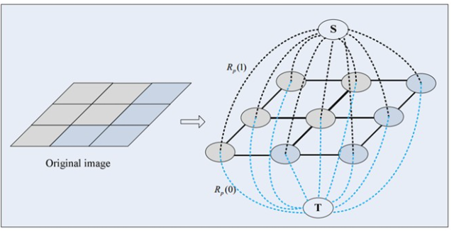
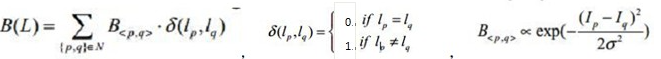
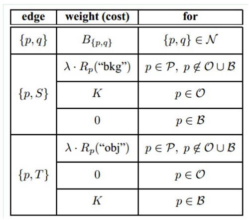

## mms

B, 32 16 32

B, 12

## 多任务VGG

## AURORA

#### 1 DDT

提取特征-> 大batch描述子均值->PCA主方向->主方向投影->大于阈值的为前景->上采样

#### 2 graphcut

##### 最大流最小割

https://www.jianshu.com/p/beca253fdc9f

##### graphcut

$$E(L)=aR(L)+B(L)$$

$$R(L) = \Sigma R(p)l_p$$

如果p和q越相似（例如它们的灰度），那么B<p,q>越大

##### 3 SPICE

 

